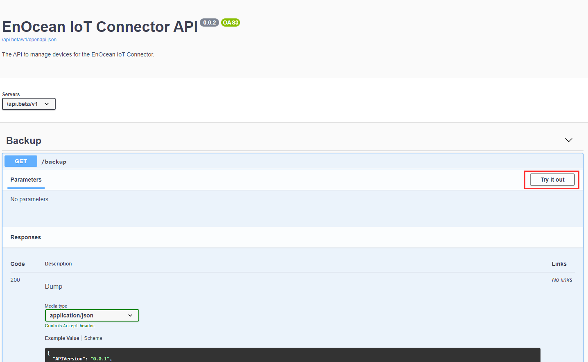
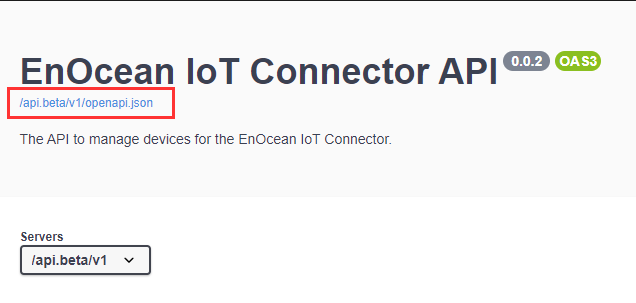
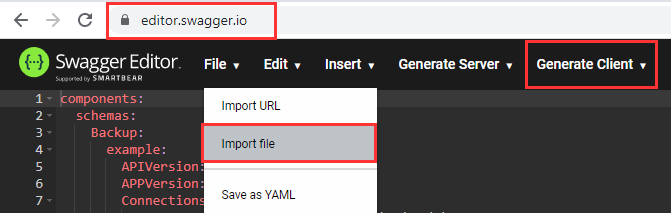

To use the Web UI follow these steps.

1. Opening the API url on a browser will display the API reference. The URL is `https://<hostname of the container group or IP address>:443`. Example: `https://192.167.1.1:443` or `https://myiotc.eastus.azurecontainer.io:443`

    !!! Note
        If you used a self-signed certificate and did not add it to your browser you will see a warning, please continue according to your web browser.

3. Login using the `BASIC_AUTH_USERNAME` & `BASIC_AUTH_PASSWORD` you specified in [environmental variables](./deployment-notes.md#overview-of-environment-variables).

You can use the `Try it out` function to execute any of the available commands for learning and debugging purposes.

Download the API Specification as JSON

Go to the editor e.g. [online here](https://swagger.io/) and generate your client code.

