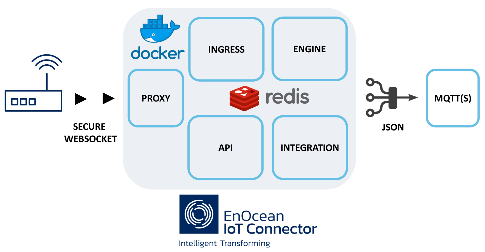

# EnOcean IoT Connector

The [EnOcean IoT Connector](https://iot.enocean.com/) (IoTC) allows for the easy processing of the super-optimized [EnOcean](https://www.enocean.com) radio telegrams. The IoTC is distributed as a group of [Docker](https://docs.docker.com/get-started/overview/) containers. All containers are hosted in the [Docker Hub](https://hub.docker.com/u/enocean).



The IoTC is composed of the following containers:

1. [enocean/iotconnector_ingress](https://hub.docker.com/repository/docker/enocean/iotconnector_ingress)
2. [enocean/iotconnector_engine](https://hub.docker.com/repository/docker/enocean/iotconnector_engine)
3. [enocean/iotconnector_api](https://hub.docker.com/repository/docker/enocean/iotconnector_api)
4. [enocean/iotconnector_integration](https://hub.docker.com/repository/docker/enocean/iotconnector_integration)
5. [Redis](https://hub.docker.com/_/redis)
6. [NGINX](https://hub.docker.com/_/nginx)

Deploying the IoTC is simple using `docker compose`. For convenience, `docker-compose.yml` files are provided to easily deploy locally (i.e. with [Docker](https://docs.docker.com/get-docker/)) or to [Azure Containers Instances](https://azure.microsoft.com/services/container-instances/) (Microsoft Azure cloud [account](https://azure.microsoft.com/free/) and subscription required).

The IoTC can either be deployed in:

- a public cloud (eg. Azure, AWS)
- private cloud
- on-premise

#### Documentation Version/Tag/SHA

`{{  git.tag }}` / ` {{git.date}}` / `{{ git.short_commit}}`

## Features

### Ingress

The ingress controls all incoming traffic from ingress gateways.

- Ingress has a secure web socket support for communication with APs.
- Ingress removes duplicates of data arriving from one sensor via several APs.
- Ingress processes the [ESP3 Protocol](https://www.enocean.com/wp-content/uploads/Knowledge-Base/EnOceanSerialProtocol3.pdf). Only Packet Type 01 & 10 are supported currently.
- The IoTC currently supports [Aruba Access Points](https://www.enocean.com/en/applications/iot-solutions/) as ingress gateways. This list is expanding.


### Engine

The IoTC engine completely supports the [EnOcean radio protocol](https://www.enocean.com/en/support/knowledge-base/) standards as defined by the [EnOcean Alliance](https://www.enocean-alliance.org/specifications/). Additionally, engine evaluates sensor health information, as well as the overall health of EIoTC solution:

- addressing encapsulation
- chaining
- decryption & validation of secure messages
- EEP processing
- information included in [signal telegram](https://www.enocean-alliance.org/st/)
- telegram statistics
- health check status

See the [Output format description](#output-format) for more details on what the engine can provide.

The following [EEPs](https://www.enocean-alliance.org/wp-content/uploads/2020/07/EnOcean-Equipment-Profiles-3-1.pdf) are supported:



A complete description and a list of all existing EEPs can be found here: [EEP Viewer](http://tools.enocean-alliance.org/EEPViewer/). If you are missing an EEP for your application please drop us an email on support-at-enocean-dot-com.

### API

The full API Specification is available [here](./api-documentation.md) or via the web Interface, once the IoTC has been deployed.

The most important features are:

- onboard / update / remove enocean devices
- get most recent data and signal telegrams of a device
- telegram statistic (e.g. count, last seen) for a device and per gateway
- list of connected ingress gateways
- persistent storage of onboarded device - if you specified a volume storage at [deployment](./deploy-the-iotc.md#1-step-by-step-deployment)
- EIoTC health check status

The API container exposes a Web UI for your convenience to see the full documentation and to have a simple client interaction.

### Integration

Integration serves as the interface between EIoTC and external systems such as various cloud services that let you build your IoT solution. Currently, we support following integration methods:
- MQTT and MQTTS (IoTC acts as a client to an external MQTT broker)
- [Azure IoT Hub](https://azure.microsoft.com/en-us/services/iot-hub/)
- [Azure IoT Central](https://azure.microsoft.com/en-us/services/iot-central/) 

The output data format is JSON, in accordance to the  `key-value` pairs defined by the [EnOcean Alliance IP Specification](http://tools.enocean-alliance.org/EEPViewer/).

### NGINX

NGINX is used as a [reverse proxy](https://www.nginx.com/) to secure IoTC. It requires valid security certificates for operation. 

A `Dockerfile` / `azure.dockerfile` and corresponding dependencies (`start.sh` and `nginx.conf`) are provided at `/deploy/nginx/` in case it needs to be rebuilt or customized.

### Redis

Redis is used as a [message broker & cache](https://redis.io/) for communication between different containers.

## MQTT Topics

Using the MQTT end-point publishes these topics:

|PATH |Description|
|-----|-----------|
|`sensor/[ID]/telemetry`&nbsp; &nbsp; &nbsp; &nbsp; &nbsp; &nbsp; &nbsp; &nbsp; &nbsp; &nbsp;&nbsp; &nbsp; &nbsp; &nbsp; &nbsp; &nbsp; &nbsp; &nbsp; &nbsp; &nbsp;|EnOcean device telemetry of a specific [ID]. Publishing is done every time a valid telegram was processed. Payload consists of JSON file described in [here](#sensor-telemetry).|
|`sensor/[ID]/meta/event/`|Event information of a specific [ID]. Publishing is done with a specific event. Reference of possible events and content of JSON files cab be found [here](#sensor-meta).|
|`sensor/[ID]/meta/stats/`|Statical information about traffic of a specific [ID]. Publishing is done in predefined time internal e.g. 10 min. Interval can be configured. This feature is optional. Configuration is done via [ENV](./deployment-notes/#overview-of-environment-variables) variables. Published JSON Payload can be reviewed [here](#sensor-meta).|
|`gateway/[MAC]/meta/event/`|Event information of a specific gateway [MAC]. Publishing is done with a specific event. Reference of possible events and more can be found [here](#gateway-meta).|
|`gateway/[MAC]/meta/stats/`|Statical information about traffic of a specific gateway [MAC]. Publishing is done in predefined time internal e.g. 10 min. Interval can be configured. This feature is optional. Configuration is done via [ENV](./deployment-notes/#overview-of-environment-variables) variables. Published JSON Payload can be reviewed [here](#gateway-meta).|
|`system/health/`|Statical information about IoTC health status. Publishing is done in predefined time internal e.g. 10 min. Interval can be configured via [ENV](./deployment-notes/#overview-of-environment-variables) variables. Published JSON Payload can be reviewed [here](#system-health).|

### Customize MQTT

The above described topic PATHs can be customized to fit the target topic space. Customization is done via [ENV](./deployment-notes/#overview-of-environment-variables) variables at deployment time.

## JSON Output Format

All Schemas of all JSON outputs can be found in the [download](./downloads.md) section.

!!! Note
    All timestamps in IoTC are in the Unix epoch (or Unix time or POSIX time or Unix timestamp). It is the number of seconds that have elapsed since January 1, 1970. It can be converted into human-readable version quite easy. e.g. use an [online convertor](https://www.epochconverter.com/).

    `timestamp = 1624367607`  equals to `GMT: Tuesday, June 22, 2021 1:13:27 PM`

### Sensor telemetry

Each output JSON consist of these sections:

- `sensor` - stored information about the sensor provided at [onboarding](./deploy-the-iotc.md#3-onboard-devices-using-the-api) via the API
- `telemetry` - information interpreted by the engine
    - `data` - sensor data included in the message and encoded via the [EEP](http://tools.enocean-alliance.org/EEPViewer/)
    - `signal` - meta information about the sensor and encoded as [signal telegram](https://www.enocean-alliance.org/st/)
    - `meta/stats` - meta information about the message added by the engine
- `raw` - raw message information
    - `rssi` - radio signal strength information. Important to track radio quality


#### telemetry -> data

The data is included in a JSON file as `key-value` pairs following the [EnOcean Alliance IP Specification](http://tools.enocean-alliance.org/EEPViewer/). Example JSON outputs from selected devices are available below.

=== "Multisensor"

    EnOcean IoT [Multisensor](https://www.enocean.com/en/products/enocean_modules/iot-multisensor-emsia-oem/)
    
    ```json
    {
        "sensor": {
            "friendlyId": "Multisensor 1",
            "id": "04138bb4",
            "location": "Cloud center"
        },
        "telemetry": {
            "data": [{
                "key": "temperature",
                "value": 23.9,
                "unit": "°C"
            }, {
                "key": "humidity",
                "value": 29.0,
                "unit": "%"
            }, {
                "key": "illumination",
                "value": 67.0,
                "unit": "lx"
            }, {
                "key": "accelerationStatus",
                "value": "heartbeat",
                "meaning": "Heartbeat"
            }, {
                "key": "accelerationX",
                "value": -0.13,
                "unit": "g"
            }, {
                "key": "accelerationY",
                "value": 0.08,
                "unit": "g"
            }, {
                "key": "accelerationZ",
                "value": -0.97,
                "unit": "g"
            }, {
                "key": "contact",
                "value": "open",
                "meaning": "Window opened"
            }],
            "signal": [],
            "meta": {
                "stats": [{
                    "egressTime": "1611927479.169171",
                    "notProcessed": 0,
                    "succesfullyProcessed": 6,
                    "totalTelegramCount": 6
                }]
            }
        },
        "raw": {
            "data": "d29fce800863b502a620",
            "sender": "04138bb4",
            "status": "80",
            "subTelNum": 0,
            "destination": "ffffffff",
            "rssi": 77,
            "securityLevel": 0,
            "timestamp": "1611927479.166352"
        }
    }
    ```

=== "CO2 sensor"

    ```json
    {
        "sensor": {
            "friendlyId": "co2_Hardware2",
            "id": "051b03c9",
            "location": "Hardware 2"
        },
        "telemetry": {
            "data": [{
                "key": "co2",
                "value": 627.45,
                "unit": "ppm"
            }, {
                "key": "learn",
                "value": "notPressed",
                "meaning": "Data telegram"
            }, {
                "key": "powerFailureDetected",
                "value": "False",
                "meaning": "Power failure not detected"
            }],
            "signal": [],
            "meta": {
                "stats": [{
                    "egressTime": "1611927535.0731573",
                    "notProcessed": 0,
                    "succesfullyProcessed": 6,
                    "totalTelegramCount": 6
                }]
            }
        },
        "raw": {
            "data": "a500005008",
            "sender": "051b03c9",
            "status": "01",
            "subTelNum": 0,
            "destination": "ffffffff",
            "rssi": 80,
            "securityLevel": 0,
            "timestamp": "1611927535.0714777"
        }
    }
    ```

=== "Switch Module"
    [PTM215](https://www.enocean.com/en/products/enocean_modules/ptm-210ptm-215/) battery-less switch module

    ```json
    {
        "sensor": {
            "friendlyId": "switch1",
            "id": "feee14ab",
            "location": "Entrance"
        },
        "telemetry": {
            "data":
            [{
                "key": "energybow",
                "value": "released",
                "meaning": "Energy Bow released"
            }],
            "signal": [],
            "meta": {
                "stats": [{
                    "egressTime": "1611927462.4711452",
                    "notProcessed": 0,
                    "succesfullyProcessed": 6,
                    "totalTelegramCount": 6
                }]
            }
        },
        "raw": {
            "data": "f600",
            "sender": "feee14ab",
            "status": "20",
            "subTelNum": 0,
            "destination": "ffffffff",
            "rssi": 71,
            "securityLevel": 0,
            "timestamp": "1611927462.469978"
        }
    }
    ```

#### telemetry -> signal

Selected devices from EnOcean transmit additionally to their data messages also messages about their internal states or events. This messages are known as signal telegrams. [Signal telegrams](https://www.enocean-alliance.org/st/) include information about the:

- percentage of remaining energy available in the energy storage
- how much energy is provided via the energy harvester
- availability and status of a back up energy store
- for additional information see the [signal telegrams](https://www.enocean-alliance.org/st/) specification and data sheet of your EnOcean product

Example of an energy `MID: 6` signal telegram is below:

```json
{
    "sensor": {
        "friendlyID": "0413D759 D2-14-41 SIMU Multisensor",
        "id": "0413d759",
        "location": "Office 265",
        "eep": "d2-14-41",
        "customTag": ""
    },
    "telemetry": {
        "data": [],
        "signal": [{
            "key": "signalIdentifier",
            "value": "0x6",
            "meaning": "Energy status of device"
        }, {
            "key": "energy",
            "value": 56.0,
            "unit": "%"
        }],
        "meta": {
            "stats": [{
                "egressTime": "1638876910.137704",
                "notProcessed": 0,
                "succesfullyProcessed": 6,
                "totalTelegramCount": 6
            }]
        }
    },
    "raw": {
        "uuid": "f521f37c-3a82-42cb-b1cc-c889e946cef3",
        "data": "d00638",
        "sender": "0413d759",
        "status": 128,
        "subTelNum": 1,
        "destination": "ffffffff",
        "rssi": -64,
        "securityLevel": 0,
        "timestamp": "1638876903",
        "subTimestamp": 0,
        "subtelegrams": []
    }
}
```
#### telemetry -> meta
The `meta` section is complementary to `data` and `signal`. The meta section includes the `stats` section as provided by the [API](#sensor-gateway-telegram-statistics) for the referenced device. Additionally the egress timestamp is included.

Examples are visible with the above examples with `data` and `signal`.

#### raw -> rssi

The `raw` element includes the radio telegram Information as received by the IoTC. They are mostly included for tracking and debug purposes. The `rssi` is the only one of interest.

The `rssi` radio signal strength information provides important information about connectivity. We recommend to track it and raise and alarm if the level drops or changes significantly.

### Sensor meta

#### event
The IoT Connector provides important information about events that were detected in regard to the sensor status, data transmission or behavior.

There are these types of events:

|Type| Event | Description|
|-|-|-|
|Security |`MAC_VALIDATION_ERROR`&nbsp; &nbsp; &nbsp; &nbsp; &nbsp; &nbsp; &nbsp; &nbsp; &nbsp;&nbsp; &nbsp; &nbsp; &nbsp; &nbsp; &nbsp; &nbsp; &nbsp; &nbsp;|A received message could not be authentificated with the included CMAC. This could be an indication for a security attack.|
||`RLC_REPLAY`|A received message has a lower message sequence counter then the previous. This could e an indication for an replay attack.|
||`DEVICE_SEND_NOW_UNSECURE`|A device which was onboarded as secure is now transmitting as non secure. This is an indication of compromision the set security level, possible attack.|
|Health |`FIRST_TIME_SEND`|An onboarded device transmitted for the first time.
|Processing|`EEP_DECODE_ERROR`|The receive message could not be decoded with the specified EEP. This is an indication for an corrupted radio message (if occuring on limited basis) or wrong specified EEP (if occuring pernament).
||`EEP_NOT_FOUND_ERROR`|The specified EEP of an device is not know to the IoTC. Please contact [support](./support.md) in such case.|

Example of an Health `FIRST_TIME_SEND` message is below:

```json
{
  "sensor": {
    "friendlyID": "Multisensor 1",
    "id": "04138d23",
    "location": "Cloud center",
    "eep": "d2-14-41",
    "customTag": ""
  },
  "meta": {
    "events": {
      "security": [],
      "health": [
        {
          "code": "FIRST_TIME_SEND",
          "message": "First time send of device with id=04138d23."
        }
      ],
      "transcoding": []
    },
     "stats": {
         "timestamp": "1637770981"
    }
  }
}
```

#### stats

The telegrams `stats` of individual EnOcean devices are posted periodically. This should indicate their operational status and additionally provide operational updates.

Example of an stats message is listed below:

```json
{
  "sensor": {
    "friendlyID": "Multisensor 1",
    "id": "04138d23",
    "location": "Cloud center",
    "eep": "d2-14-41",
    "customTag": ""
  },
  "meta": {
     "stats": {
      "lastSeen": "1637827538",
      "notProcessed": 1,
      "succesfullyProcessed": 6,
      "totalTelegramCount": 0
      }
    }
  }
}
```

The content of the `stats` section corresponds to the response of the device telegram statics [API request](#sensor-gateway-telegram-statistics).

### Gateway meta

#### event
Selected AP (e.g. Aruba AP) transmits meta information about their internal states referenced as Gateway Health Updates. The content is similar to the [console log](./support.md#console-log-messages) messages.

The purpose of this message includes these two use cases:
-	Still-alive message from the gateway. Know the gateway is operation.
-	EnOcean USB Dongle information of the gateway. Know the USB Dongle is correctly operating.

Example of an meta event of gateways is listed below:

```json
{
  "gateway_info": {
    "mac": "aabbccddeeff",
    "softwareVersion": "8.8.0.0",
    "hardwareDescriptor": "AP-505"
  },
  "stats": {
    "timestamp": "1639039720"
  },
  "usb_info": [
    {
      "usb_identifier": "ENOCEAN_USB:deb480d77718bbbe5253896b9300acfd",
      "usb_health": "healthy"
    }
  ]
}
```

#### stats

The telegrams `stats` of individual gateways are posted periodically. This should indicate their operational status and additionally provide operational updates.

Example of an stats message is listed below:

```json
{
  "gateway_info": {
    "mac": "aabbccddeeff",
    "softwareVersion": "8.8.0.0",
    "hardwareDescriptor": "AP-505"
  },
  "stats": {
      "lastSeen": "1637827538",
      "notProcessed": 0,
      "succesfullyProcessed": 6,
      "totalTelegramCount": 6
  }

}
```

The content of the `stats` section corresponds to the response of the gateway telegram statics [API request](#sensor-gateway-telegram-statistics).

### System health

IoTC periodically checks the status of the containers to validate correct operation of IoTC. After each check, a system health notification is sent on MQTT to notify the application of the IoTC status. The application should examine the health notification and notify the system administrator in case issues are observed. The application should also use the periodic health notification as a keep alive and expect issues if the health notifications are not received. 

Example of the system health event is listed below:

```json
{
  "gateway_info": [
    {
      "mac": "a1b2c3d4e5f6",
      "status": "healthy",
      "timestamp": "2022-05-18T09:25:33Z"
    }
  ],
  "system_health": {
    "api": "running",
    "ingress": "running",
    "integration": "running",
    "mqtt": "running",
    "redis": "running"
  }
}
```

## Technical Requirements

The different containers of the IoTC require the [Docker](https://docs.docker.com/get-started/overview/) environment to run. Specific requirements (i.e. RAM, CPU) depend on the number of connected end points to the IoTC at runtime and their communication frequency. Typical installations (e.g. 100 connected AP, 500 EnOcean end points) can be run at common embedded platforms on the market e.g. RPi gen 4.

The IoTC was load tested in laboratory conditions with 200 Gateways / APs with trasnfering in total 2000 EnOcean Messages within 10 seconds. No issues or message lose was detected.

For Azure Cloud deployments we recommend to use the `docker-compose.yml` file listed in  `azure_deployment` directory.

## Used 3rd party components and libraries, OSS Components

**Components:**

- Redis Community(https://redis.io/)
- Python 3.8 (https://www.python.org/)
- Docker Community (https://docs.docker.com/get-docker/)
- NGINX Community (https://www.nginx.com/)
- Mosquitto (https://mosquitto.org/)


 **Python Libraries:**

- Async Redis (aioredis,https://github.com/aio-libs/aioredis-py, MIT License)
- HIREDIS (hiredis,https://github.com/redis/hiredis,BSD License)
- Licensing (licensing,https://github.com/Cryptolens/cryptolens-python,MIT License)
- Protobuf (protobuf,https://developers.google.com/protocol-buffers/,https://github.com/protocolbuffers/protobuf/blob/master/LICENSE)
- Pydantic (pydantic,https://github.com/samuelcolvin/pydantic/,MIT License)
- Redis (redis,https://github.com/andymccurdy/redis-py,MIT License)
- Tornado (tornado,https://github.com/tornadoweb/tornado,Apache License 2.0)
- Flask (flask,https://flask.palletsprojects.com/en/1.1.x/,BSD=https://flask.palletsprojects.com/en/0.12.x/license/)
- Conexion (conexion,https://github.com/zalando/connexion,https://github.com/zalando/connexion/blob/master/LICENSE.txt)
- Azure (azure,https://github.com/Azure/azure-sdk-for-python,MIT)
- Bitstring (bitstring,https://github.com/scott-griffiths/bitstring,MIT)
- crc8 (crc8,https://github.com/niccokunzmann/crc8,MIT)
- paho-mqtt (paho-mqtt,http://www.eclipse.org/paho/,BSD=https://projects.eclipse.org/projects/iot.paho)
- pycryptodome (pycryptodome, https://github.com/Legrandin/pycryptodome,https://github.com/Legrandin/pycryptodome/blob/master/LICENSE.rst)
- Celery (celery,https://github.com/celery/celery,https://github.com/celery/celery/blob/master/LICENSE)

## License Agreement and Data Privacy

Please see the License agreement [here](./LA-IoTC.pdf).

Please see the Data privacy agreement [here](./DPA-IoTC.pdf).

## Disclaimer

The information provided in this document describes typical features of the EnOcean software products and should not
be misunderstood as specified operating characteristics. No liability is assumed for errors and / or omissions. We
reserve the right to make changes without prior notice.
