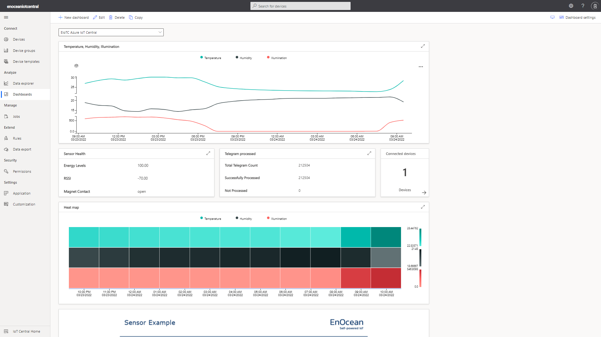

# Azure IoT Central Integration
EnOcean IoT Connector can be easily setup to serve as the data source for [Azure IoT Central](https://azure.microsoft.com/en-us/services/iot-central/). Azure IoT Central is an application platfrom-as-a-service (aPaaS) that allows easy development, management, and maintenance of enterprise-grade IoT solutions.



IoT Central offers a variety of integration methods. We use combination of IoT Central device bridge and Azure Service Bus. Device bridge forwards data from devices connected to EnOcean IoTC through to IoT Central application. The device bridge solution provisions several Azure resources into your Azure subscription that work together to transform and forward device messages to IoT Central. At the same time Azure Service Bus is utilized to provide the ability to provision new EnOcean devices directly from Azure IoT Central console.

## Step-by-step deployment

Here is step-by-step guide for setting up the device bridge, Service Bus and EnOcean IoTC. This integration uses [device bridge provided by Microsoft](https://github.com/Azure/iotc-device-bridge).

### Prepare required keys

1. Get **ID scope** and **SAS Primary key** from IoT Central App > Permissions > Device connection groups > SAS-IoT-Devices. 
2. Create API token (**IOT_CENTRAL_TOKEN**) from IoT Central App > Permissions > API Tokens > New.   

### Deploy the device bridge 

1. Go to [Azure Custom Deployment](https://portal.azure.com/#create/Microsoft.Template/uri/https%3A%2F%2Fraw.githubusercontent.com%2FAzure%2Fiotc-device-bridge%2Fmaster%2Fazuredeploy.json).
2. Fill in the required keys from previous step.
3. Review + Create
4. On Azure Portal go to Function App and select your newly deployed function. 
5. From Function App menu go to Development Tools > Console and execute commands below
```
cd IoTCIntegration
npm install
```
6. Go to Overview and restart the Function on Azure Portal
7. Go to Functions > IoTCIntegration > Code + Test and "Get function URL". This will be used in iotconnector_engine variables as **IOT_BRIDGE_ADDRESS**

### Deploy Azure Service Bus and create a new queue

1. In Azure Portal go to Service Bus and select create a new service bus with basic pricing tier and same resource group from previous step.
2. After the deployment is done, go to resource menu, select Shared access policies>RootManagedSharedAccessKey and note **Primary Connection String**. This will be used as **IOT_CENTRAL_SERVICE_BUS_CONN_STR**.
3. From the main Service Bus menu create new Queue and note its name. This will be used as **IOT_CENTRAL_SERVICE_BUS_QUEUE**.  

### Create data export on IoT Central
1. Go to IoT Central > Data Export, create a new destination. As a destination type choose Azure Service Bus Queue and input previously obtained **Primary Connection String** and the queue name.
2. In Data Export menu create new export. Select _device lifecycle events_ as the type. Input following Enrichment property key:value pairs
```
device_name: Device name
device_temp: Device template name
```
Also set the destination to your previously created export destination.
 
### Modify the docker-compose.yml file to enable integration
1. Add variables below to *engine* containers environment variables on docker-compose.yml
```
- IOT_ENABLE_IOTCENTRAL=1
- IOT_CENTRAL_ADDRESS= # this is the URL of your IoT Central App
- IOT_CENTRAL_TOKEN=
- IOT_BRIDGE_ADDRESS=
```
2. Add the *integration* container to docker-compose.yml as below. Please use provided docker-compose.yml as a guideline.
```
    integration:
        image: enocean/iotcentral_integration:latest
        environment:
            - IOT_CENTRAL_SERVICE_BUS_CONN_STR= # Service bus connection string
            - IOT_CENTRAL_SERVICE_BUS_QUEUE= # Name of the service bus queue
            - EIOTC_API_URL=https://proxy/api.beta/v1/
            - BASIC_AUTH_USERNAME=
            - BASIC_AUTH_PASSWORD=
```