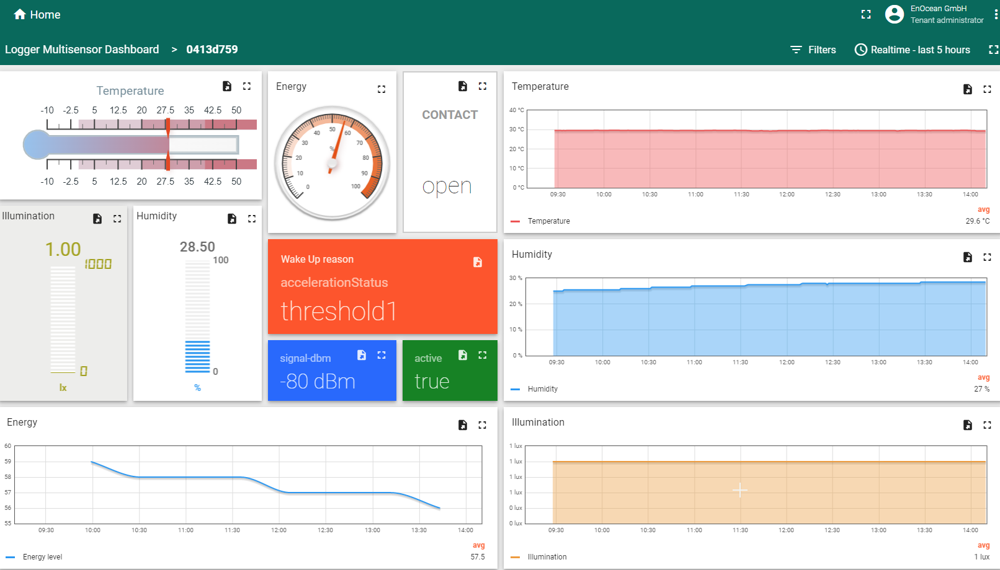

# Thingsboard Integration
EnOcean IoT Connector can be easily connected to the [Thingsboard](https://thingsboard.io/) platform, and you can easily visualize the data.

Thingsboard offers many integration options. The most straight forward is a [platform integration](https://thingsboard.io/docs/paas/user-guide/integrations/) with [MQTT](https://thingsboard.io/docs/paas/user-guide/integrations/mqtt/). This is a Thingsboard Professional Edition feature available for Thingsboard Cloud or own platform instances.

For this purpose we provide the Uplink converter (direction seen from Thingsboard view). The converter takes the default output JSON Files and converts it to the Thingsboard expected format. The converter script can be found [here](../scripts/thingsboard-uplink.js).

## Step-by-step integration
Thingsboard itself offers a very detailed manual [here](https://thingsboard.io/docs/paas/user-guide/integrations/remote-integrations/) and more specific for MQTT [here](https://thingsboard.io/docs/paas/user-guide/integrations/remote-integrations/). We tested and deployed it with a [thingboard.cloud](https://thingsboard.io/products/paas/) deployment.

For an IoTC integration into Thingsboard you have to consider:

1. Deploy an IoTC instance and send the data to a MQTT Broker which is publicly available. e.g. Deploy IoTC in Azure Cloud with mosquito broker as described [here](./deploy-the-iotc.md#1-step-by-step-deployment).
2. Onboard some EnOcean devices or use the [simulation UI](./deploy-ui-simulation.md). It is Important to confirm that data are sent via MQTT. e.g. confirm your [MQTT Explorer](./deploy-the-iotc.md#3-onboard-devices-using-the-api) is connected to the MQTT Broker.
3. [Deploy](https://thingsboard.io/pricing/) Thingsboard at your self-managed platform or create yourself a Thingsboard [cloud](https://thingsboard.cloud/) account.
4. Use the Thingsboard integration [guide](https://thingsboard.io/docs/paas/user-guide/integrations/remote-integrations/) to set up integration for the IoTC.
    1. At the step of [Uplink converter](https://thingsboard.io/docs/user-guide/integrations/mqtt/#uplink-converter) copy and paste the script in the file [here](../scripts/thingsboard-uplink.js).
    2. When asked for a topic filter at integration setup, specify `sensor/+/telemetry` as a default MQTT topics.
Finish the remaining steps. For downlink just keep the default generated script from Thingsboard. If you are using the debug mode in integration you should already see some events on communicated telegrams.
5. If everything worked well, you should see [devices](https://thingsboard.io/docs/paas/user-guide/ui/devices/) that have sent a telegram after the integration in your devices list and the profiles. If your devices do not send any telegrams you will not see them in the list; please trigger a transmission to confirm the integration.
6. Create [dashboards](https://thingsboard.io/docs/paas/user-guide/dashboards) to visualize the data.
